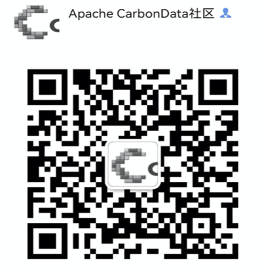

<!--
    Licensed to the Apache Software Foundation (ASF) under one or more
    contributor license agreements.  See the NOTICE file distributed with
    this work for additional information regarding copyright ownership.
    The ASF licenses this file to you under the Apache License, Version 2.0
    (the "License"); you may not use this file except in compliance with
    the License.  You may obtain a copy of the License at

      http://www.apache.org/licenses/LICENSE-2.0
    
    Unless required by applicable law or agreed to in writing, software
    distributed under the License is distributed on an "AS IS" BASIS,
    WITHOUT WARRANTIES OR CONDITIONS OF ANY KIND, either express or implied.
    See the License for the specific language governing permissions and
    limitations under the License.
-->

Apache CarbonData is an indexed columnar data store solution for fast analytics on big data platform, e.g. Apache Hadoop, Apache Spark, etc.

You can find the latest CarbonData document and learn more at:
[http://carbondata.apache.org](http://carbondata.apache.org/)

[CarbonData cwiki](https://cwiki.apache.org/confluence/display/CARBONDATA/)

## Status
Spark2.4:

## Features
CarbonData file format is a columnar store in HDFS, it has many features that a modern columnar format has, such as splittable, compression schema, complex data type etc, and CarbonData has following unique features:
* Stores data along with index: it can significantly accelerate query performance and reduces the I/O scans and CPU resources, where there are filters in the query.  CarbonData index consists of multiple level of indices, a processing framework can leverage this index to reduce the task it needs to schedule and process, and it can also do skip scan in more finer grain unit (called blocklet) in task side scanning instead of scanning the whole file.
* Operable encoded data: through supporting efficient compression and global encoding schemes, can query on compressed/encoded data, the data can be converted just before returning the results to the users, which is "late materialized".
* Supports for various use cases with one single Data format : like interactive OLAP-style query, Sequential Access (big scan), Random Access (narrow scan).

## Building CarbonData
CarbonData is built using Apache Maven, to [build CarbonData](https://github.com/apache/carbondata/blob/master/build)

## Online Documentation
* [What is CarbonData](https://github.com/apache/carbondata/blob/master/docs/introduction.md)
* [Quick Start](https://github.com/apache/carbondata/blob/master/docs/quick-start-guide.md)
* [Use Cases](https://github.com/apache/carbondata/blob/master/docs/usecases.md)
* [Language Reference](https://github.com/apache/carbondata/blob/master/docs/language-manual.md)
 * [CarbonData Data Definition Language](https://github.com/apache/carbondata/blob/master/docs/ddl-of-carbondata.md) 
 * [CarbonData Data Manipulation Language](https://github.com/apache/carbondata/blob/master/docs/dml-of-carbondata.md) 
 * [CarbonData Streaming Ingestion](https://github.com/apache/carbondata/blob/master/docs/streaming-guide.md) 
 * [Configuring CarbonData](https://github.com/apache/carbondata/blob/master/docs/configuration-parameters.md) 
 * [Index Developer Guide](https://github.com/apache/carbondata/blob/master/docs/index-developer-guide.md) 
 * [Data Types](https://github.com/apache/carbondata/blob/master/docs/supported-data-types-in-carbondata.md) 
* [CarbonData Index Management](https://github.com/apache/carbondata/blob/master/docs/index/index-management.md) 
 * [CarbonData BloomFilter Index](https://github.com/apache/carbondata/blob/master/docs/index/bloomfilter-index-guide.md) 
 * [CarbonData Lucene Index](https://github.com/apache/carbondata/blob/master/docs/index/lucene-index-guide.md)
 * [CarbonData MV](https://github.com/apache/carbondata/blob/master/docs/mv-guide.md)
* [Carbondata Secondary Index](https://github.com/apache/carbondata/blob/master/docs/index/secondary-index-guide.md)
* [Heterogeneous format segments in carbondata](https://github.com/apache/carbondata/blob/master/docs/addsegment-guide.md)
* [SDK Guide](https://github.com/apache/carbondata/blob/master/docs/sdk-guide.md) 
* [C++ SDK Guide](https://github.com/apache/carbondata/blob/master/docs/csdk-guide.md)
* [Performance Tuning](https://github.com/apache/carbondata/blob/master/docs/performance-tuning.md) 
* [S3 Storage](https://github.com/apache/carbondata/blob/master/docs/s3-guide.md)
* [Distributed Index Server](https://github.com/apache/carbondata/blob/master/docs/index-server.md)
* [CDC and SCD](https://github.com/apache/carbondata/blob/master/docs/scd-and-cdc-guide.md)
* [Carbon as Spark's Datasource](https://github.com/apache/carbondata/blob/master/docs/carbon-as-spark-datasource-guide.md) 
* [FAQs](https://github.com/apache/carbondata/blob/master/docs/faq.md) 

## Experimental Features

Some features are marked as experimental because the syntax/implementation might change in the future.
1. Hybrid format table using Add Segment.
2. Accelerating performance using MV on parquet/orc.
3. Merge API for Spark DataFrame.
4. Hive write for non-transactional table.
5. Secondary Index as a Coarse Grain Index in query processing.

##  Integration
* [Hive](https://github.com/apache/carbondata/blob/master/docs/hive-guide.md)
* [Presto](https://github.com/apache/carbondata/blob/master/docs/prestodb-guide.md)
* [Alluxio](https://github.com/apache/carbondata/blob/master/docs/alluxio-guide.md)
* [Flink](https://github.com/apache/carbondata/blob/master/docs/flink-integration-guide.md)

## Other Technical Material
* [Apache CarbonData meetup material](https://cwiki.apache.org/confluence/pages/viewpage.action?pageId=66850609)
* [Use Case Articles](https://cwiki.apache.org/confluence/display/CARBONDATA/CarbonData+Articles)

## Fork and Contribute
This is an active open source project for everyone, and we are always open to people who want to use this system or contribute to it. 
This guide document introduces [how to contribute to CarbonData](https://github.com/apache/carbondata/blob/master/docs/how-to-contribute-to-apache-carbondata.md).

## Contact us
To get involved in CarbonData:

* First join by emailing to [dev-subscribe@carbondata.apache.org](mailto:dev-subscribe@carbondata.apache.org), then you can discuss issues by emailing to [dev@carbondata.apache.org](mailto:dev@carbondata.apache.org). 
  You can also directly visit [dev@carbondata.apache.org](https://lists.apache.org/list.html?dev@carbondata.apache.org). 
  Or you can visit [Apache CarbonData Dev Mailing List archive](http://apache-carbondata-dev-mailing-list-archive.168.s1.nabble.com/). 
  
* Report issues on [Apache Jira](https://issues.apache.org/jira/browse/CARBONDATA). If you do not already have an Apache JIRA account, sign up [here](https://issues.apache.org/jira/).

* You can also slack to get in touch with the community. After we invite you, you can use this [Slack Link](https://carbondataworkspace.slack.com/) to sign in to CarbonData.

* Of course, you can scan the QR Code to join in our WeChat Group to get in touch.
  

  

## About
Apache CarbonData is an open source project of The Apache Software Foundation (ASF).

